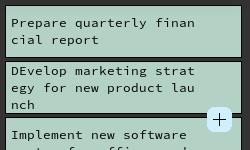
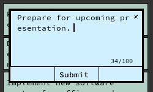

# TODOWidget

## Overview

TODOWidget is a simple and lightweight desktop widget for Linux, created using pure X11's low-level API XLib with no external dependencies in C. This widget allows you to keep track of your TODOs right on your desktop.




## Features

1. **Pure X11 Implementation**: 
   - Developed using X11's low-level XLib API with no external dependencies.
   
2. **Desktop Widget**:
   - Appears as a widget on the Linux desktop with no window decoration, blending seamlessly with your desktop environment.
   
3. **TODO Management**:
   - Create and remove TODO items.
   - TODOs are stored locally in an SQLite3 database for persistence.
   
4. **Learning Project**:
   - A hobby project designed to learn and explore the Linux windowing system (X11).

## Getting Started

### Prerequisites

- Linux Distro
- X11 development libraries
- SQLite3 C library
- GCC

### Installation

1. Clone the repository:
   ```bash
   git clone https://github.com/devmt04/TODOWidget.git
   cd TODOWidget
   ```

2. Compile and Run the Project
	```bash
	make run
	```

3. Debug Project with GDB
	```bash
	make debug
	```

## Contributing

Contributions are welcome! If you have suggestions, bug reports, or improvements, feel free to open an issue or submit a pull request.

## License

This project is licensed under the Apache 2.0 License - see the [LICENSE](LICENSE) file for details.

## Acknowledgements

This project is a hobby project to learn more about the Linux windowing system (X11) and is inspired by the need for a simple and efficient desktop widget for managing TODOs.